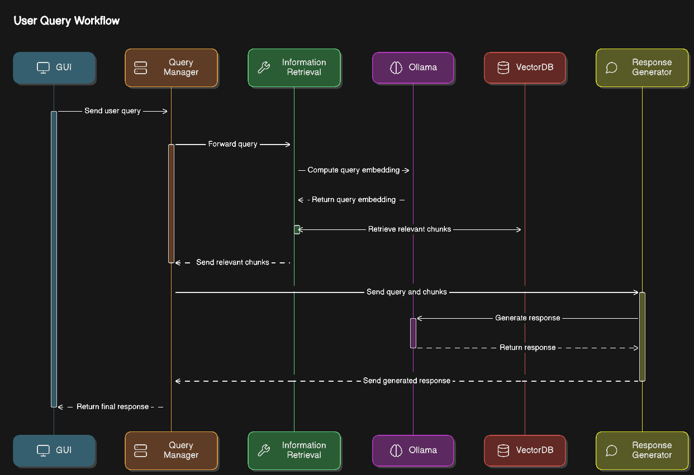
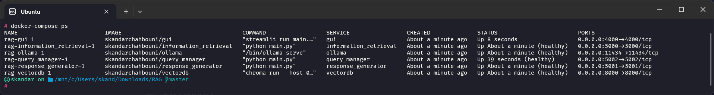
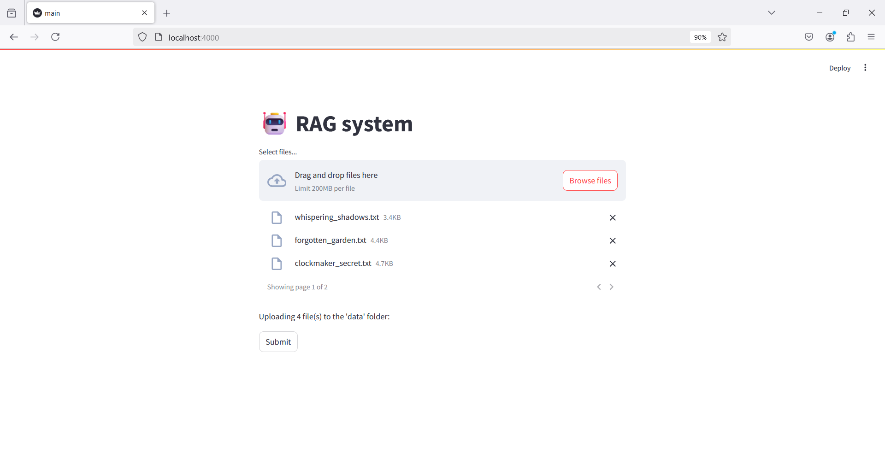
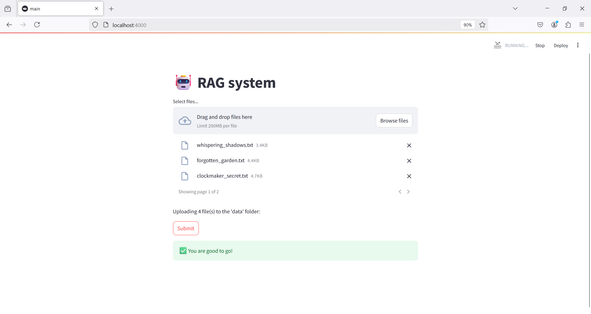
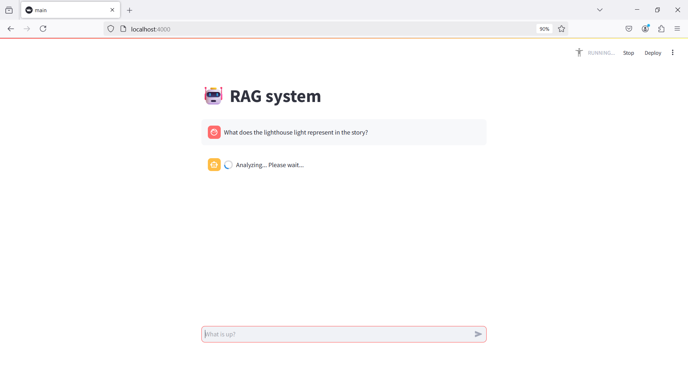
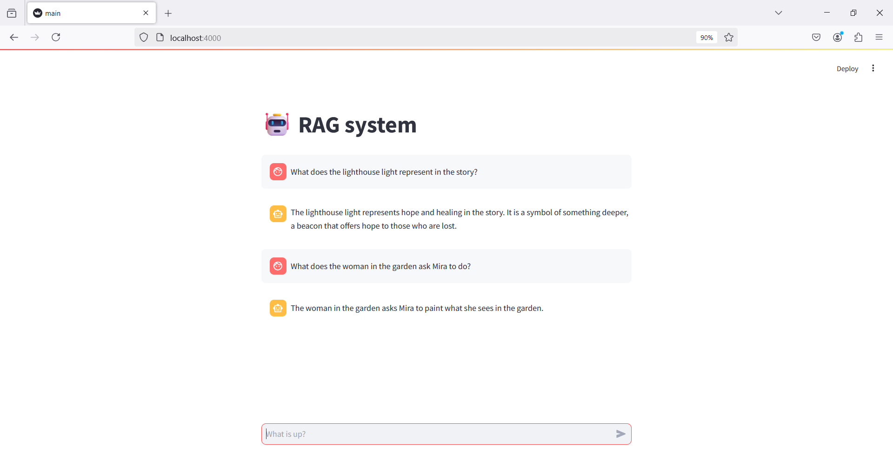

# 🤖 RAG System with Microservices Architecture

This project implements a Retrieval-Augmented Generation (RAG) system using a microservices architecture. The system enables users to upload files, process them into chunks, store embeddings, and answer user queries based on those embeddings, all orchestrated by various microservices.

## 🏗️ Architecture Overview

The system consists of the following microservices:

1. **🖥️ GUI (Graphical User Interface)**
   - Built using Streamlit.
   - Allows users to upload files.
   - Splits the content of uploaded files into chunks and calculates embeddings for those chunks.
   - Stores the embeddings in a Chroma vector database.
   - Includes a chat interface to interact with the system.

2. **🧠 Query Manager**
   - Receives user queries via the chat system.
   - Calls the **Information Retrieval** service to fetch relevant chunks.
   - Calls the **Response Generator** service to generate an answer based on the relevant chunks.
   - Returns the final response to the user.

3. **🔍 Information Retrieval**
   - Computes the embedding of the user query.
   - Retrieves the most relevant chunks from the vector database by calculating similarity between the query embedding and the chunk embeddings.

4. **💬 Response Generator**
   - Uses an LLM to generate a response to the user query based on the relevant chunks retrieved by the Information Retrieval service.
   - The query is processed with a template like:
     ```python
     modelquery = f"{query} - Answer that question using the following text as a resource: {docs}"
     ```

5. **🗄️ Vector Database (Chroma)**
   - Stores embeddings of file chunks uploaded by the user.
   - Provides efficient storage and retrieval of chunk embeddings for fast and accurate information retrieval.

6. **⚡ Ollama**
   - Contains the embedding model used to generate embeddings for chunks and queries.
   - Contains the generator model used to generate responses to user queries based on the context.

Here is a diagram summarizing the user query workflow in this system:


## 🗂️ Project Structure

```
RAG-System/
├── gui/                          # Streamlit-based frontend for file upload and interaction
├── query_manager/                # Manages user queries and orchestrates the microservices
├── information_retrieval/        # Retrieves relevant chunks based on query similarity
├── response_generator/           # Generates a response using LLMs
├── vectordb/                     # Chroma database for storing and retrieving embeddings
├── ollama/                       # Contains models for embeddings and response generation
├── docker-compose.yml            # Docker Compose file for running the system
├── README.md                     # Project documentation
```

## 🛠️ Installation

### Prerequisites

- Docker and Docker Compose installed on your machine.

### Install Dependencies

1. Clone the repository:

   ```bash
   git clone <repository_url>
   cd RAG-System
   ```

### Run the Project Using Docker Compose

To run the entire system using Docker Compose, follow these steps:

1. Make sure Docker and Docker Compose are installed on your system.
2. In the root directory of the project, run:

   ```bash
   docker-compose up 
   ```

   This will start all necessary services (GUI, Query Manager, Information Retrieval, Response Generator, Vector Database, and Ollama) in containers.

3. Once the services are running, open your browser and navigate to the URL provided by the `docker-compose` logs (typically `http://localhost:4000` for gui).

### Interact with the System

- **Upload Files**: Use the GUI to upload files that you want to process.
- **Submit Queries**: Enter your queries into the chat interface and receive responses based on the file chunks stored in the vector database.
- **Get Responses**: The system will retrieve relevant chunks and generate answers using LLMs.

## 🚀 Usage

1. **Upload Files**: Use the GUI to upload the files you wish to process. The **documents** folder in the project directory contains some sample documents that you can use for testing. You can upload these documents to see how the system processes them.

2. **Submit Queries**: After uploading, input your queries into the chat interface. Here are some example questions you can try using the sample documents:
   - What does the lighthouse light represent in the story?
   - What does Clara ask Elias to make for her?
   - What does the woman in the garden ask Mira to do?
   - What do the Whispering Shadows tell Hannah she needs?

## 🖼️ Screenshots

|         |         |
|---------|---------|
|  |  |
|  |  |


## 📽️ Demo
- You can view the demo by following this [link](https://drive.google.com/file/d/1MGCUfDa_M2dILiT1QBiox_HyKkcQ5y_y/view?usp=sharing).
